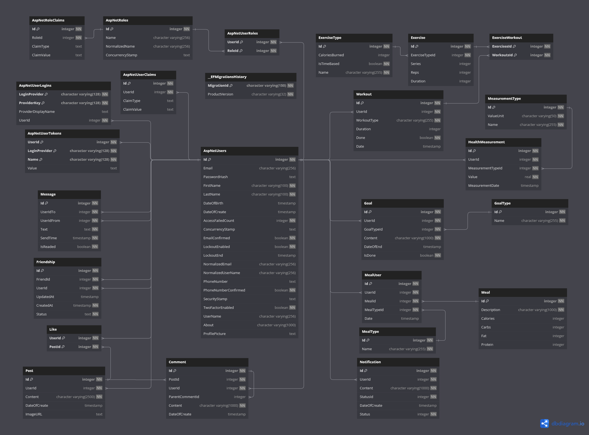

# HealthTracker

## 📋 Description 

HealthTracker is a **modular monolithic application** designed for tracking and managing health-related data. Additionally, it can be used as a small social media platform thanks to its Community Module, where users can create posts, manage friend lists, and chat in real time. 
The application is composed of three core projects:

- healthtracker.client (*Frontend*)
- HealthTracker.Server (*Backend*)
- HealthTracker.Server.Tests (*Testing*)


## 🛠️ Technologies

### Backend

- **.NET 8.0**
- **ASP.NET Core**
- **Entity Framework Core**: ORM used for database management with code-first approach.
- **Authentication and Authorization**: Implemented using ASP.NET Identity with JWT for secure token-based authentication, and Google OAuth for external authentication.
- **HTTPS**: All communications between the client and server are encrypted and secured using HTTPS.
- **SignalR**: Used for real-time communication in chat functionality.
- **Serilog**: Used to log errors specifically during API requests that result in an internal server error.
- **AutoMapper**: Used for simplifying object-to-object mapping between DTOs and domain models.
- **Swagger**: Provides interactive API documentation for easier testing and development.

### Frontend

- **Vue.js 3**
- **SPA**: Single-Page Application architecture.
- **Vue Router**: Handles client-side routing in the SPA.
- **Pinia stores**: Used for maintaining state and sharing data between components [[link]](https://pinia.vuejs.org/).
- **Axios**: The frontend communicates with the backend via RESTful APIs.
- Mobile responsive application.

### Database

- **PostgreSQL**: Database built with code-first approach using EF Core.

### Testing

- **xUnit**: Framework for backend unit testing.
- **Moq**: Used for mocking dependencies.
- **EF Core InMemory**: Used for testing repository without hitting the actual database.

## ✨ Modules and Features

- Core Module
    - Auth
        - Login with email or username
        - Login with Google account
        - Register a new user
    - Profile
        - View user information
        - Change user avatar
        - Review friends and friendship requests
        - Accept or decline friendship requests
        - Send friendship requests
        - Review posts
        - Review goals
    - Dashboard: (*Admin-only feature, Under development*)
- Community & Motivation Module
    - View posts from friends and interact with them by liking or commenting
    - Create posts with Markdown preview
    - Search for users using the search bar
    - Real-time chat with friends
    - View friend list
- Health Tracking Module: (*Under development*)
- Diet Journal Module: (*Under development*)
- Workout Planner Module: (*Under development*)
- Goals & Progress Module: (*Under development*)

## 🛤️ Application Routes

HealthTracker has the following URL paths, allowing users to navigate different sections of the application. Some paths require user authentication or admin privileges.

### Public Routes:
- `/` – The home page of the application.
- `/about` – The "About" page with information about the application.
- `/login` – The login page, where users can log into their accounts.
- `/register` – The registration page, where new users can create an account.
- `/login-success` – Redirect page after successful login.
- `/login/pass-reset` – The password reset page for users who need to recover their accounts.
- `/login/new-pass` – The page to set a new password after the reset process.
- `/logout` – The page through which the user logs out of the application.
- `/unauthorized` – The page shown when a user without proper permissions attempts to access a restricted page.

### Authenticated Routes:
- `/community` – The "Community" page, where users can view, like, and comment on posts from friends.
- `/community/post/create` – The page for creating a new community post.
- `/diary` – The "Meals" page.
- `/goals` – The "Goals and Progress" page.
- `/health` – The "Health Check" page.
- `/planner` – The "Trainings Planner" page.
- `/profile` – The profile page, where users can manage their profile information, avatar, posts and friend list.
- `/profile/{id}` – A user's profile page, where users can view the profile of another user by entering their ID in the URL.

### Admin Routes:
- `/dashboard` – The admin-only dashboard, which provides management tools for the application and users.

### Other:
- The 404 page, shown when a user navigates to an invalid URL.


## 🏛️ Project Architecture

The HealthTracker project follows a **layered modular architecture**, with clear separation of concerns and responsibilities across different layers and modules. Each module represents a distinct domain within the system, making the application both easily scalable and maintainable.

### Backend Structure

The backend is designed with a layered approach:

#### Key Characteristics
- **Core Module**: This is the main module, and it interacts with other modules. It contains essential functionality and serves as the central point for managing domain-specific logic.
- **Infrastructure Layer**: Responsible for managing hubs, data access configuration, services, and storing Entity Framework Core migrations.

#### Module Structure
- **Controllers**: Defines the API endpoints that handle incoming HTTP requests and send responses back to the client.
- **Repositories**: Providing an abstraction layer for database queries.
- **Models**: Domain models representing the entities in the system.
- **DTOs**: Data Transfer Objects that encapsulate the data transferred between the client and the server.
- **Helpers**: Contains utility classes and helper functions.
- **Assets**: Stores static assets specific to each module.

### Frontend Structure

The frontend is structured to support modular development, with each feature or domain represented as a separate module.

#### Key Characteristics
- **Single-Page Application (SPA)**: The frontend is a SPA using Vue.js 3.
- **Shared**: Contains reusable elements that are used across multiple modules.
- **Router**: Manages routes across the entire application.
- **Api**: Handles communication with the backend via RESTful APIs, using *Axios* library.
- **Assets**:  Stores static assets such as icons, images, and styles that are used across the application.

#### Module structure
- **Components**: Represents reusable Vue components for the UI. Each module has its own set of components that implement specific functionality.
- **Pages**: Defines the main pages used in module.
- **Data**: Contains static data used in specified module.
- **Store**: Centralized state management of data for each module, using *Pinia*.
- **Types**: Defines TypeScript types and interfaces.
- **Routes**: Manages route definitions specific to each module.

## 🔐 Security and Access Control

HealthTracker enforces strict security and access control policies to protect user data and ensure only authorized access.

#### **Authentication**
- **JWT Authentication**: Users receive a valid JWT after a successful login, which must be included in the `Authorization` header for API requests.
- **Google Authentication**: Users can also authenticate using their Google accounts.
#### **Authorization**
- **Role-based Authorization**:
    - **Admin**: Has access to admin-specific features, such as the `Dashboard` and management endpoints.
    - **User**: Standard user role.
- **Non-authenticated users**: Cannot access any data from the REST API.

#### **HTTPS Enforcement**:
- All communication between the client and server is secured with HTTPS, ensuring encrypted and secure data transmission.
#### **CORS Policy**
- Only specific origins are allowed to communicate with the API, ensuring secure cross-origin requests. 

## 📄 Documentation

Each module contains its own detailed documentation. Click on the links below to access specific documentation.

#### Core Modules
- [Auth](docs/auth.md)
- [Profile](docs/profile.md)
- [Dashboard](docs/dashboard.md)

#### Feature Modules
- [Community & Motivation](docs/community.md)
- [Health Tracking](docs/healthtracking.md)
- [Diet Journal](docs/dietjournal.md)
- [Workout Planner](docs/workoutplanner.md)
- [Goals & Progress](docs/goals.md)


## 🗂️ Database Model

The following diagram represents the database model used in the application:

## 🚀 Installation

Follow these steps to install and run the HealthTracker application on your local machine. The project consists of both a backend (ASP.NET Core) and a frontend (Vue.js). You'll also need to set up a PostgreSQL database and update the connection string in the backend configuration.

### Prerequisites

- **.NET 8.0 SDK**: Download from [here](https://dotnet.microsoft.com/en-us/download/dotnet/8.0)
- **Node.js**: Download from [here](https://nodejs.org/)
- **PostgreSQL**

### Backend setup

1. Clone the repository:
   ```bash
   git clone https://github.com/DamianSubzda/HealthTracker.git
   cd HealthTracker
   ```
2. Configure the connection string to your local database:
Open the `appsettings.Development.json` file (or create one if there isn't any) in the HealthTracker.Server folder and add the default connection string with your local PostgreSQL configuration.

   ```json
   {
     "ConnectionStrings": {
       "HealthTrackerDBconnString": "Host=localhost;Port=yourport;Database=HealthTrackerDB;Username=yourusername;Password=yourpassword"
     }
   }
   ```

   Replace `yourusername` and `yourpassword` and `yourport` with your actual PostgreSQL credentials.

3. Configure Google Authentication:
To enable Google authentication, add your OAuth 2.0 credentials (Client ID and Client Secret) to the `appsettings.Development.json` file under the "Authentication" section. These credentials can be obtained by creating an OAuth 2.0 Client ID in the [Google Developer Console](https://console.cloud.google.com).

   ```json
   "Authentication": {
     "Google": {
       "ClientId": "your-google-client-id",
       "ClientSecret": "your-google-client-secret"
     }
   }
   ```

   Replace `your-google-client-id` and `your-google-client-secret` with the actual values from your Google Developer Console.

4. Apply database migrations:
After setting up the connection string, apply the EF Core migrations to create the necessary database tables.

   ```bash
   cd HealthTracker.Server
   dotnet ef database update
   ```

5. Restore dependencies and run the backend:
Restore the required NuGet packages and run the backend API.

   ```bash
   dotnet restore
   dotnet run
   ```

   The backend API should now be running at `https://localhost:7170`

### Frontend Setup
1. Navigate to the frontend project folder and install dependencies:

   ```bash
   cd healthtracker.client
   npm install
   ```

2. Run the frontend:

   ```bash
   npm run dev
   ```

   The frontend should now be running at `https://localhost:5174`.

## ✅ Testing

The application has been tested using 148 unit tests, covering controllers, repositories, hubs, services, and models.

To run the tests, navigate to the test project and run the following command:

   ```bash
   cd HealthTracker.Server.Tests
   dotnet test
   ```

## 📝 License

The application is available under the MIT License. See the [LICENSE](LICENSE) file for details.
