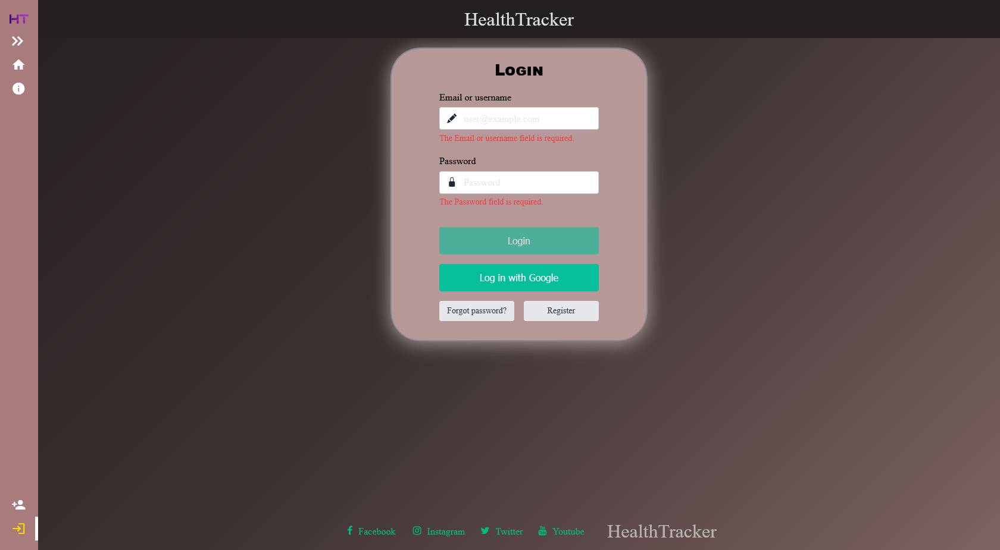
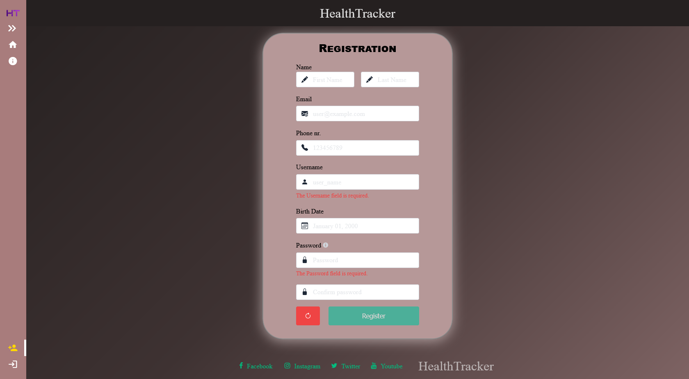
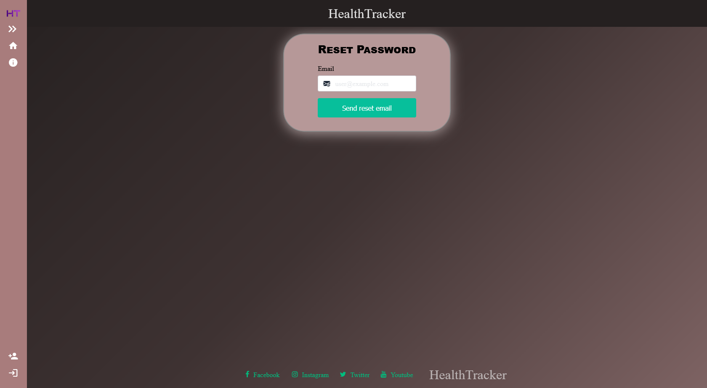

# Profile Documentation

## ✨ Features

- **Login Form**: Users can log in with either their email or username. After a successful login, they will be redirected to the home page.
- **Register Form**: Allows users to create a new account by providing their email, username, and other personal details.
- **Reset Password Form**: (*Under development*) A form that will allow users to reset their forgotten passwords.
- **Assign Admin Role**: Admins can assign specific users to the "Admin" role.

## 🖼️ Page view

Login form:


Register form:


Reset password form:


## 🌐 API Reference - AuthController

#### Login:

```http
POST /login
```

| Parameter | Type     | Location | Description                |
| :-------- | :------- |:---------| :------------------------- |
| `EmailUserName` | `string` | Body |**Required**. Email or username for login |
| `Password` | `string` | Body |**Required**. User's password |

#### Register:

```http
POST /register
```

| Parameter | Type     | Location | Description                       |
| :-------- | :------- |:---------| :-------------------------------- |
| `Email`   | `string` | Body | **Required**. Must be a valid email address |
| `UserName`| `string` | Body | **Required**. Username for the new user (max length: 100) |
| `FirstName`| `string`| Body | **Required**. First name of the user (max length: 100) |
| `LastName`| `string` | Body | **Required**. Last name of the user (max length: 100) |
| `PhoneNumber`| `string?`| Body | **Optional**. User's phone number (max length: 9) |
| `DateOfBirth`| `DateTime?`| Body | **Optional**. User's date of birth |
| `Password` | `string`| Body | **Required**. Password for the new user |

#### Google Login: 

**Description**: Redirects the user to the Google login page:

```http
GET /login-google
````

#### Handle Google Login:

**Description**: Handles the callback from Google after the user successfully logs in and redirects the user back to the frontend with user information.

```http
GET /handle-google-login
````

#### Assign Admin Role

**Description**: Requires Admin role.

```http
POST /assign-admin-role/{userId}
```

| Parameter | Type     | Location | Description                |
| :-------- | :------- |:---------| :------------------------- |
| `userId` | `string` | Path |**Required**. The ID of the user to assign the admin role to |
