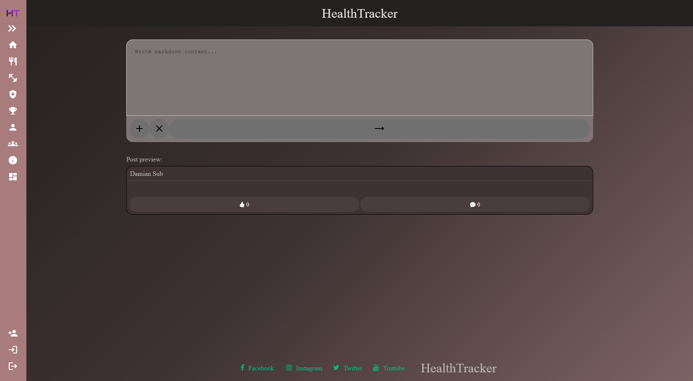

# Community Documentation

## ✨ Features

- View posts from friends and interact with them:
  - Load posts with pagination and infinite scroll feature 
  - Like posts
  - Comment on posts
  - Comment under parent comment creating a comments tree
  - View others' comments
  - Load comments with pagination
- Search for users using the search bar:
  - After typing at least 3 characters, users are searched by their first and last names
  - Users can click on a searched user to be redirected to their profile
- Real-time chat with friends:
  - By clicking on a friend in the friend list, you can display the chat window
  - Text input for writing messages
  - The chat is built with a reversed infinite scroll feature
  - New messages are displayed automatically via SignalR
  - Messages are visually distinguished by color and alignment ("left-right") depending on whether they are from you or other users
  - Ability to hide and expand the chat window
  - Notifications for new messages
- View the friend list:
  - Notification icon next to each user with unread messages
  - Display chat by clicking on a friend from the list
- Create posts with Markdown preview:
  - Post input field
  - Post preview with Markdown support
  - Buttons to add or remove attachments from posts
  - Button to create a new post
 
## 🖼️ Page view

Community page:


Post comments:


Chat close & open:


Chat notification:


Search bar:


Create new post page:




## 🌐 API Reference

### FriendshipController

#### Create a Friendship Request:

```http
POST /api/users/friends
```
| Parameter | Type     | Location | Description                |
| :-------- | :------- |:---------| :------------------------- |
| `UserId` | `int` | Body |**Required**. The ID of the user sending the request |
| `FriendId` | `int` | Body |**Required**. The ID of the friend receiving the request |

#### Get a Friendship:

```http
GET /api/users/friends/{friendshipId}
```
| Parameter | Type     | Location | Description                |
| :-------- | :------- |:---------| :------------------------- |
| `friendshipId` | `int` | Path |**Required**. The ID of the friendship |

#### Get a Friendship by Users id:

```http
GET /api/users/{userId}/friends/{friendId}
```

| Parameter | Type     | Location | Description                |
| :-------- | :------- |:---------| :------------------------- |
| `userId` | `int` | Path |**Required**. The ID of the user in the friendship |
| `friendId` | `int` | Path |**Required**. The ID of the friend in the friendship |

#### Get a list of user's friends:

```http
GET /api/users/{userId}/friends
```

| Parameter | Type     | Location | Description                |
| :-------- | :------- |:---------| :------------------------- |
| `userId` | `int` | Path |**Required**. The ID of the user    |

#### Get a list of friendship requests for user:

```http
GET /api/users/{userId}/friends/requests
```

| Parameter | Type     | Location | Description                |
| :-------- | :------- |:---------| :------------------------- |
| `userId` | `int` | Path |**Required**. The ID of the user    |

#### Accept a friendship request:

```http
GET /api/users/{userId}/friends/{friendId}/accept
```

| Parameter | Type     | Location | Description                |
| :-------- | :------- |:---------| :------------------------- |
| `userId` | `int` | Path |**Required**. The ID of the user    |
| `friendId` | `int` | Path |**Required**. The ID of the friend|

#### Decline a friendship request:

```http
GET /api/users/{userId}/friends/{friendId}/decline
```

| Parameter | Type     | Location | Description                |
| :-------- | :------- |:---------| :------------------------- |
| `userId` | `int` | Path |**Required**. The ID of the user    |
| `friendId` | `int` | Path |**Required**. The ID of the friend|

#### Delete a friendship:

```http
DELETE /api/users/{userId}/friends/{friendId}
```

| Parameter | Type     | Location | Description                |
| :-------- | :------- |:---------| :------------------------- |
| `userId` | `int` | Path |**Required**. The ID of the user    |
| `friendId` | `int` | Path |**Required**. The ID of the friend|

### ChatController

#### Create a message:

```http
POST /api/users/messages
```

| Parameter | Type     | Location | Description                |
| :-------- | :------- |:---------| :------------------------- |
| `UserIdFrom` | `int` | Body |**Required**. The ID of the user creating (sending) message|
| `UserIdTo` | `int` | Body |**Required**. The ID of the user receiving message|
| `Text` | `string` | Body |**Required**. The message text |

#### Get a message:

```http
GET /api/users/messages/{messageId}
```

| Parameter | Type     | Location | Description                |
| :-------- | :------- |:---------| :------------------------- |
| `messageId` | `int` | Path |**Required**. The ID of the message|

#### Get a list of messages:

```http
GET /api/users/messages/{userFrom}/{userTo}
```

| Parameter | Type     | Location | Description                |
| :-------- | :------- |:---------| :------------------------- |
| `userFrom` | `int` | Path |**Required**. The ID of the user creating (sending) message|
| `userTo` | `int` | Path |**Required**. The ID of the user receiving message|
| `pageNumber` | `int` | Query |**Required**. The number of returned page|
| `pageSize` | `int` | Query |**Optional**. The size of returned page|

#### Get a number Of New Messages for user:

```http
GET /api/users/messages/{userFrom}/{userTo}/new
```

| Parameter | Type     | Location | Description                |
| :-------- | :------- |:---------| :------------------------- |
| `userFrom` | `int` | Path |**Required**. The ID of the user creating (sending) message|
| `userTo` | `int` | Path |**Required**. The ID of the user receiving message|

#### Update Messages To Read status:

```http
PUT /api/users/messages/{userFrom}/{userTo}
```

| Parameter | Type     | Location | Description                |
| :-------- | :------- |:---------| :------------------------- |
| `userFrom` | `int` | Path |**Required**. The ID of the user sending message|
| `userTo` | `int` | Path |**Required**. The ID of the user receiving message|

### PostController

#### Create post:

```http
POST /api/users/posts
```

| Parameter | Type     | Location | Description                |
| :-------- | :------- |:---------| :------------------------- |
| `UserId` | `int` | Body |**Required**. The ID of the user creating post|
| `Content` | `string` | Body |**Required**. The post text content|
| `ImageFile` | `IFormFile?` | Body |**Optional**. The image file in post attachment|

#### Get the post:

```http
GET /api/users/posts/{postId}
```

| Parameter | Type     | Location | Description                |
| :-------- | :------- |:---------| :------------------------- |
| `postId` | `int` | Body |**Required**. The ID of the post|

#### Get the list of the posts on users wall:

```http
GET /api/users/{userId}/wall/posts
```

| Parameter | Type     | Location | Description                |
| :-------- | :------- |:---------| :------------------------- |
| `userId` | `int` | Path |**Required**. The ID of the user |
| `pageNumber` | `int` | Query |**Required**. The page number of posts to retrieve|
| `pageSize` | `int` | Query |**Optional**. The page size|


#### Get the list of user`s posts:

```http
GET /api/users/{userId}/posts
```

| Parameter | Type     | Location | Description                |
| :-------- | :------- |:---------| :------------------------- |
| `userId` | `int` | Path |**Required**. The ID of the user |
| `pageNumber` | `int` | Query |**Required**. The page number of posts to retrieve|
| `pageSize` | `int` | Query |**Optional**. The page size|

#### Delete post:

```http
DELETE /api/users/posts/{postId}
```

| Parameter | Type     | Location | Description                |
| :-------- | :------- |:---------| :------------------------- |
| `postId` | `int` | Body |**Required**. The ID of the post|

#### Create like (like post):

```http
POST /api/users/posts/likes
```

| Parameter | Type     | Location | Description                |
| :-------- | :------- |:---------| :------------------------- |
| `UserId` | `int` | Body |**Required**. The ID of the user    |
| `PostId` | `int` | Body |**Required**. The ID of the post    |

#### Get like:

```http
GET /api/users/{userId}/posts/{postId}/likes
```

| Parameter | Type     | Location | Description                |
| :-------- | :------- |:---------| :------------------------- |
| `userId` | `int` | Path |**Required**. The ID of the user    |
| `postId` | `int` | Path |**Required**. The ID of the post    |

#### Get likes from post:

```http
GET /api/users/posts/{postId}/likes
```

| Parameter | Type     | Location | Description                |
| :-------- | :------- |:---------| :------------------------- |
| `postId` | `int` | Path |**Required**. The ID of the post    |

#### Delete like:

```http
DELETE /api/users/{userId}/posts/{postId}/likes
```

| Parameter | Type     | Location | Description                |
| :-------- | :------- |:---------| :------------------------- |
| `userId` | `int` | Path |**Required**. The ID of the user    |
| `postId` | `int` | Path |**Required**. The ID of the post    |

### CommentController

#### Create a comment under a post:

```http
POST /api/users/posts/comments/{parentCommentId}
```

| Parameter | Type     | Location | Description                |
| :-------- | :------- |:---------| :------------------------- |
| `parentCommentId` | `int` | Path |**Optional**. The ID of the parent comment. If omitted, it's a main comment |
| `PostId` | `int` | Body |**Required**. The ID of the post    |
| `UserId` | `int` | Body |**Required**. The ID of the user    |
| `Content` | `string` | Body |**Required**. The content of comment |

#### Get comment by ID:

```http
GET /api/users/posts/comments/{commentId}
```

| Parameter | Type     | Location | Description                |
| :-------- | :------- |:---------| :------------------------- |
| `commentId` | `int` | Path |**Required**. The ID of the comment    |


#### Get a list of comments under the post:

```http
GET /api/users/posts/{postId}/comments
```

| Parameter | Type     | Location | Description                |
| :-------- | :------- |:---------| :------------------------- |
| `postId` | `int` | Path |**Required**. The ID of the post    |
| `pageNumber` | `int` | Path |**Required**. The page number of comments to retrieve|
| `pageSize` | `int` | Path |**Optional**. The size of page    |

#### Get child comments by the comment ID:

```http
GET /api/users/posts/{postId}/comments/{parentCommentId}
```

| Parameter | Type     | Location | Description                |
| :-------- | :------- |:---------| :------------------------- |
| `postId` | `int` | Path |**Required**. The ID of the post    |
| `parentCommentId` | `int` | Path |**Required**. The ID of the parent comment |

#### Delete comment:

```http
DELETE /api/users/posts/comments/{commentId}
```

| Parameter | Type     | Location | Description                |
| :-------- | :------- |:---------| :------------------------- |
| `commentId` | `int` | Path |**Required**. The ID of the comment |

#### Delete all comments for user:

```http
DELETE /api/users/{userId}/posts/comments
```

| Parameter | Type     | Location | Description                |
| :-------- | :------- |:---------| :------------------------- |
| `userId` | `int` | Path |**Required**. The ID of the user |

#### Delete all comments under post:

```http
DELETE /api/users/posts/{postId}/comments
```

| Parameter | Type     | Location | Description                |
| :-------- | :------- |:---------| :------------------------- |
| `postId` | `int` | Path |**Required**. The ID of the post |


