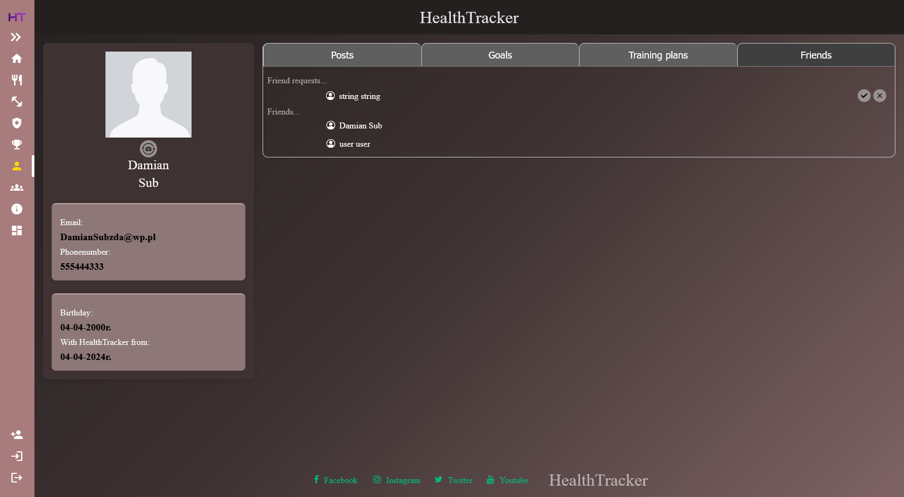
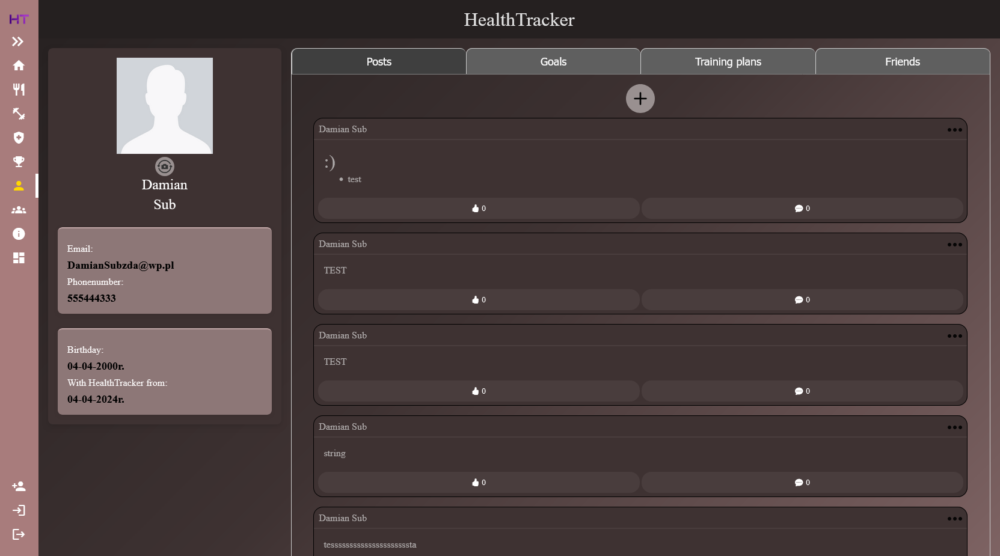
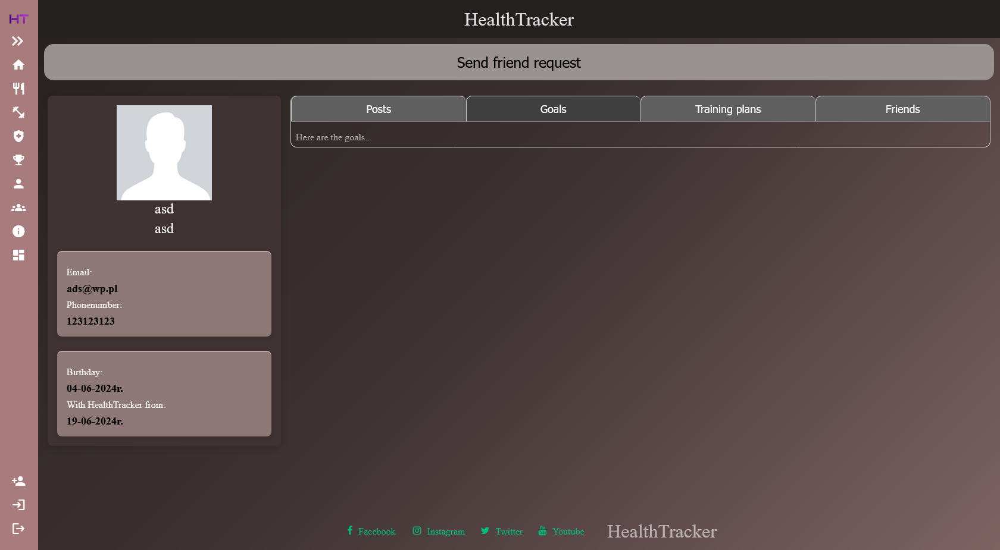

# Profile Documentation

The **Profile** element is used to display information about users. Users can visit other users's profiles as well as their own. The differences between visiting your own profile and someone else's are listed further in the documentation.

## ✨ Features

### Users' Profiles
- **Sending friendship requests**: When visiting a profile that is not your own and no friendship request has been sent before, you will see a button at the top displaying "Send friendship request".

### Own Profile:
- **Image change**: Users can change their own profile image by clicking the button below the image.
- **In the "Posts" tab**:
    - A button redirects to the *"Create New Post"* page, where users can create posts in markdown, add a photo attachment, and see the post preview.
    - Users can interact with their own posts, view comments, likes, and delete their own posts.
- **In the "Friends" tab**:
    - Users can see friendship requests and accept or decline them.

### Both
- **View user information**: Users can see details like profile image, email, phone number, birthday, and registration date.
- **See user's friends**: View a list of the user's friends.
- **See user's posts**: View posts created by the user.

## 🖼️ Page view
Tab friends in own profile:


Tab posts in own profile:


Button to send friendship request on user profile:


## 🌐 API Reference - ProfileController

#### Get user information by ID:

```http
GET /api/users/{id}
```

| Parameter | Type     | Location | Description                |
| :-------- | :------- | :------- | :------------------------- |
| `id` | `int` | Path |**Required**. The ID of the user |

#### Get a list of users that match the search query:

```http
GET /api/users/{id}/search
```

| Parameter | Type     | Location | Description                       |
| :-------- | :------- | :------- | :-------------------------------- |
| `id`      | `int` | Path | **Required**. The ID of the user performing the search |
| `query`      | `string` | Query | **Required**. The search query |

#### Set user photo:

```http
POST /api/users/{id}/photo
````
| Parameter | Type     | Location | Description                       |
| :-------- | :------- | :------- | :-------------------------------- |
| `id`      | `int` | Path |**Required**. The ID of the user |
| `photo`      | `IFormfile` | FormData | **Required**. The image file to upload |
